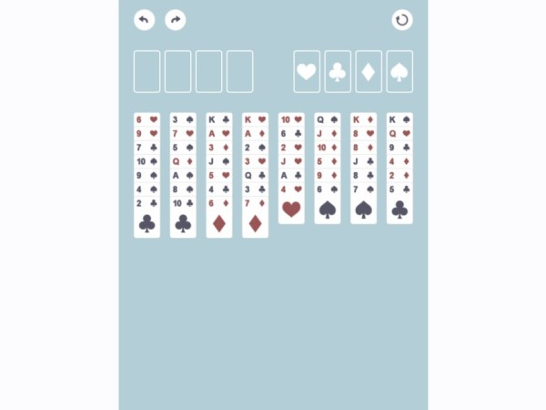

FreeCell
====



TypeScript製のフリーセルです。  
描画等に[PixiJS](https://github.com/pixijs/pixi.js)、アニメーションに[tween.js](https://github.com/tweenjs/tween.js)を使用しています。

[ブラウザでプレイ](https://yamada1ta.gitlab.io/freecell-demo)

## ビルド手順
npmを使用するため、[Node.js](https://nodejs.org)のインストールが必要です。

### 画像アセットの導入
[デモ](https://yamada1ta.gitlab.io/freecell-demo)では[こちらのサイト](http://icooon-mono.com)の画像素材を使用していますが、このリポジトリにはファイルを含んでいません。  
以下のリストに沿ってダウンロードとリネームを行い、/public/assets/images に配置してください。  
ダウンロードの際、colorは白（rgb 255, 255, 255）、ファイル形式はPNGを選んでください。

* heart.png  
http://icooon-mono.com/14002-%E3%83%8F%E3%83%BC%E3%83%88%E3%81%AE%E3%83%9E%E3%83%BC%E3%82%AF/

* club.png  
http://icooon-mono.com/11902-%E3%82%AF%E3%83%AD%E3%83%BC%E3%83%90%E3%83%BC%E3%81%AE%E3%83%9E%E3%83%BC%E3%82%AF%E3%81%AE%E7%B4%A0%E6%9D%90/

* diamond.png  
http://icooon-mono.com/14001-%E3%83%80%E3%82%A4%E3%83%A4%E3%81%AE%E3%83%9E%E3%83%BC%E3%82%AF/

* spade.png  
http://icooon-mono.com/13999-%E3%82%B9%E3%83%9A%E3%83%BC%E3%83%89%E3%82%A2%E3%82%A4%E3%82%B3%E3%83%B31/

* undo.png  
http://icooon-mono.com/15913-%E8%BF%94%E4%BF%A1%E7%9F%A2%E5%8D%B02/

* redo.png  
undo.pngを左右反転

* restart.png  
http://icooon-mono.com/11972-%E3%83%AA%E3%83%AD%E3%83%BC%E3%83%89%E3%81%AE%E3%83%95%E3%83%AA%E3%83%BC%E3%82%A2%E3%82%A4%E3%82%B3%E3%83%B3/

### 依存ライブラリの導入
リポジトリをクローンした後、`npm install`を実行してください。

### ローカルで実行
```
npm run serve
```
上記コマンドを実行後、http://localhost:4000 にアクセスしてください。

### ビルド
```
npm run build
```
distディレクトリにファイルが出力されます。

## ライセンス
[MIT](LICENSE)

## 作成者
[yamada1ta](https://github.com/yamada1ta)
